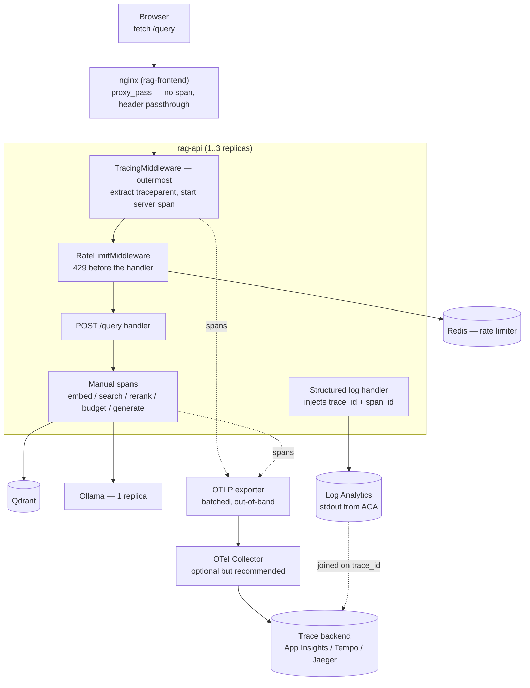
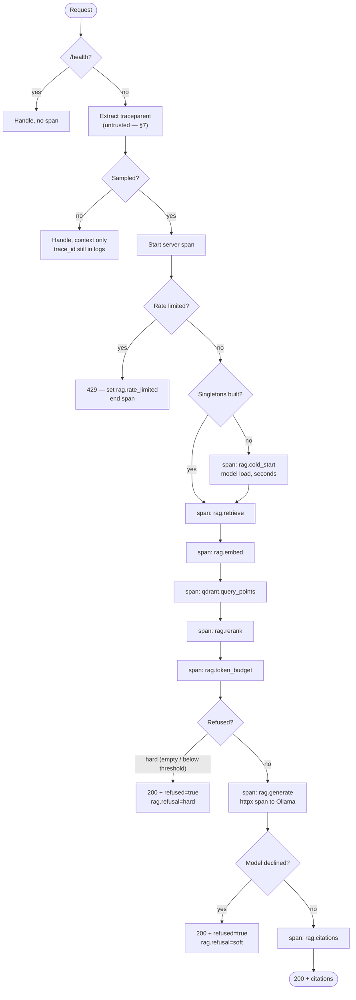

# Structured Request Tracing — Design

## 1. Overview & goals

A `/query` request today produces four unattributed log lines at most, printed
in a plain-text format with no request identity:

```
2026-08-20 11:04:12 INFO app.core.rate_limit Rate limit allowed client=9f2c1ab4de70 path=/query
2026-08-20 11:04:21 ERROR app.api.query LLM error: timeout
```

Nothing joins those two lines to each other, to a user, or to the nine seconds
that elapsed between them. When someone reports "the app was slow", there is no
way to answer *where* the time went — embedding, vector search, reranking, or
generation — because the only instrumented boundary is the HTTP request itself,
and the interesting work is all inside it.

This document defines what to trace, which instrumentation approach to adopt,
how trace context crosses the frontend → nginx → API → Qdrant/Ollama hops, and
what must **not** end up in a span.

Goals:

- Attribute end-to-end latency to a stage: embed, search, rerank, budget, generate.
- Make refusals, rate-limit rejections and upstream failures queryable rather
  than anecdotal.
- Correlate logs, traces and metrics through one identifier.
- Keep question text and prompt bodies out of telemetry by default (§8).
- Avoid committing to a telemetry vendor before there is a reason to.

Non-goals:

- Replacing the evaluation harness. Traces measure the *running system*;
  `eval/run_eval.py` measures answer quality. Tracing a golden-set run is a
  side benefit, not the point.
- Profiling. Spans locate the slow stage; they do not explain why a Python
  function is slow.
- Log aggregation infrastructure. ACA already ships stdout to Log Analytics
  ([`docs/deployment-strategy.md`](deployment-strategy.md)); this document only
  changes what is written, not how it is shipped.

> Status: implemented. Approach **D** (§4) is in the code, disabled by default
> (`TRACING_ENABLED=false`). Steps 1–4 of the rollout in §15 are done; step 5
> (a real backend) and §12's metrics are not.

## 2. The questions tracing has to answer

An instrumentation plan is only as good as the questions it can answer. These
are the ones this system actually generates, and each one drives a specific
design decision later.

| Question | Why it is unanswerable today | Drives |
|---|---|---|
| Where did the 9 seconds go? | Nothing times the stages inside `query()` | §6 span tree |
| Is Ollama generating or queueing? | `generate()` discards the timing fields Ollama returns | §6 attributes |
| Why was the *first* request after a deploy slow? | `_embedder()`, `_store()` and `_llm()` are `lru_cache` singletons built lazily on the first request | §6 cold-start span |
| How often do we refuse, and hard or soft? | Both refusals return **HTTP 200**, so status codes say nothing | §6 `rag.refused` |
| Which requests never reached the handler? | The rate limiter answers 429 from middleware | §5 middleware order |
| Which user hit the failing path? | `logger.error("Retrieval error: %s", exc)` has no identity and no stack | §6 error recording |
| Did the answer cite anything, and how many chunks survived the token budget? | Not recorded anywhere | §6 attributes |

Note the pattern: every one of these is *inside* the application, in code that
no generic HTTP instrumentation can see. That observation is what decides §4.

## 3. Terminology, because "tracing" is three different things

These are routinely conflated, and the cheapest useful subset is the first one
alone:

- **Correlation ID** — one identifier per request, attached to every log line.
  Answers "show me everything about this request".
- **Structured logs** — log records as key/value objects rather than
  interpolated strings, so they are queryable by field.
- **Distributed trace** — a tree of timed, attributed spans that crosses
  process boundaries. Answers "where did the time go" and "what called what".

The three compose: a trace ID makes a fine correlation ID, and structured logs
are how a log record carries it. The decision in §4 is really *how far along
this ladder to climb*.

## 4. Approach comparison

**Recommendation: OpenTelemetry — auto-instrumentation for the transport hops,
hand-written spans for the RAG stages — exported over OTLP, with trace IDs
injected into structured logs.**

| Approach | What it gives | What it cannot answer | Cost / risk | Verdict |
|---|---|---|---|---|
| **A. Correlation ID + structured JSON logs** | Every line joinable per request; no new services; ~100 lines | Stage latency, only if you hand-time and hand-log each stage — reinventing spans as log lines | Near zero | **Rejected as the end state, adopted as step 1** (§13) |
| **B. OpenTelemetry, manual spans only** | Exactly the spans in §6, full control of attributes | Nothing about the Qdrant/Ollama HTTP calls unless each is wrapped by hand | `opentelemetry-api` + `-sdk`; instrumentation drifts as code moves | Viable, but leaves free signal on the table |
| **C. OpenTelemetry auto-instrumentation only** | FastAPI server spans, httpx client spans to Qdrant and Ollama, Redis spans — near zero code | Embedding time (pure in-process CPU), rerank, token budgeting, refusal reason. The interesting half (§2) is invisible | One extra instrumentation package per library | Necessary, not sufficient |
| **D. B + C (chosen)** | Transport spans for free, semantic spans where they matter, one coherent tree | — | Both of the above | **Chosen** |
| **E. Vendor SDK directly (Azure Monitor / App Insights)** | Tightest Azure integration, one dependency, portal dashboards | — | Instrumentation calls are vendor-shaped; changing backend means re-instrumenting | Rejected as the *instrumentation* layer; fine as the *backend* (§10) |
| **F. LLM-native platform (Langfuse, Phoenix, LangSmith)** | Purpose-built prompt/response/token UI, eval integration | Weak on the non-LLM half — Redis, ASGI, the rate limiter — so you end up running two systems | A second telemetry pipeline and a second place to leak prompt text (§8) | Rejected now; revisit if prompt iteration becomes the main activity |
| **G. Metrics only (Prometheus / OTel metrics)** | Cheap aggregate latency, refusal rate, error rate | Nothing about an *individual* slow request; percentiles hide the one user who waited 40s | Low | Complementary, not a substitute (§12) |

### Why not stop at A

Approach A is genuinely tempting: a `contextvar` holding a UUID, a logging
filter, and a JSON formatter. It answers "what happened to this request" and it
costs nothing. It fails on the *primary* question — where the time went —
because answering that with logs means emitting a start line and an end line per
stage and subtracting timestamps in the query language. That is a trace, built
badly, with no parent/child relationships and no way to represent the Qdrant
call nested inside retrieval.

### Why OpenTelemetry rather than a vendor SDK

The API/SDK split is the deciding property. `opentelemetry-api` is a no-op when
no SDK is configured: instrumented code runs at negligible cost and emits
nothing. That means **the instrumentation can be merged before the backend
question (§10) is settled**, and the backend can change later without touching
`app/core/`. A vendor SDK inverts that — the export decision is baked into every
call site.

The cost is honest: OpenTelemetry's Python packaging is more fragmented than a
single vendor SDK (separate `-api`, `-sdk`, `-exporter-otlp`, and one
`-instrumentation-*` per library, several still pre-1.0), and the GenAI
semantic conventions are explicitly experimental (§6).

### Why D rather than C alone

Auto-instrumentation sees sockets. This system's cost is not sockets:
`BGEEmbedder.embed()` is in-process CPU with no network call at all, reranking
and token budgeting are pure Python, and the refusal decision — the single most
important business outcome — happens inside `decide_evidence()`. Ship C for the
free transport spans, then add the five hand-written spans that make the trace
mean something.

## 5. Architecture

### Where the instrumentation sits



Three things in that picture are deliberate:

- **Tracing middleware is outermost.** Starlette applies `add_middleware` in
  reverse registration order — the last registered is the outermost wrapper. In
  [`app/main.py`](../backend/app/main.py) the rate limiter is registered first
  and CORS second, so CORS is currently outermost. Tracing must be registered
  **after** both, or every 429 the rate limiter returns is invisible to tracing
  — and rejected traffic is exactly what you want to see when investigating
  a complaint.
- **Export is out-of-band and batched.** The exporter must never sit on the
  request path; a telemetry backend outage must degrade to dropped spans, never
  to failed queries (§9).
- **Logs and traces travel different routes and rejoin on the ID.** Logs go to
  Log Analytics via stdout because ACA already does that for free. Trying to
  push logs through OTLP as well is a second pipeline for no gain at this size.

### Request path



The branch that matters: **both refusal paths return HTTP 200.** A dashboard
built on status codes will show a perfectly healthy service that is refusing
every question. `rag.refused` and `rag.refusal_kind` are not nice-to-have
attributes; they are the only signal that distinguishes those outcomes.

## 6. Span model for `POST /query`

| Span | Kind | Source | Key attributes |
|---|---|---|---|
| `POST /query` | server | auto (FastAPI) | `http.route`, `http.response.status_code`, `rag.client_hash`, `rag.rate_limited` |
| `rag.cold_start` | internal | manual, first request only | `rag.component` = embedder \| store \| llm |
| `rag.retrieve` | internal | manual | `rag.top_k`, `rag.candidate_k`, `rag.chunks_returned`, `rag.refused`, `rag.top_score`, `rag.score_margin` |
| `rag.embed` | internal | manual | `rag.embed_model`, `rag.query_tokens` |
| `qdrant.query_points` | client | auto (httpx), wrapped by a manual `rag.search` | `server.address`, `http.response.status_code`, + manual `rag.collection`, `rag.candidate_k` |
| `rag.rerank` | internal | manual | `rag.overlap_terms`, `rag.reordered` |
| `rag.token_budget` | internal | manual | `rag.token_budget`, `rag.tokens_used`, `rag.chunks_dropped` |
| `rag.generate` | client | manual, wraps auto httpx span | `gen_ai.*` (below) |
| `rag.citations` | internal | manual | `rag.citations_count`, `rag.cited_indices_valid` |

### Attribute naming: two namespaces, on purpose

- **`gen_ai.*` for the model call** — `gen_ai.system`, `gen_ai.request.model`,
  `gen_ai.usage.input_tokens`, `gen_ai.usage.output_tokens`. These follow the
  OpenTelemetry GenAI semantic conventions, which vendor dashboards already
  understand. They are also **experimental and have already been renamed once**,
  so pin the convention version and expect a migration. That instability is the
  trade-off for portability.
- **`rag.*` for everything else** — there is no stable convention for "chunks
  that survived a token budget" or "refusal because the score margin was too
  thin". A private namespace is stable because we own it, and portable to
  nothing, which is the correct trade for domain-specific fields.

### The Ollama timing fields are already being thrown away

[`app/core/llm.py`](../backend/app/core/llm.py) returns `response["response"]`
and discards the rest. Ollama's response also carries `total_duration`,
`load_duration`, `prompt_eval_count`, `prompt_eval_duration`, `eval_count` and
`eval_duration`. Those distinguish *the model was busy with someone else* from
*the model was slow generating for us* — which, on a deployment pinned to a
single Ollama replica ([`infra/aca/ollama.yaml`](../infra/aca/ollama.yaml)), is
the difference between "add capacity" and "shorten the prompt".

Recording them means the adapter must see them, and there are two ways:

| Option | Trade-off |
|---|---|
| Record inside `OllamaLLM.generate()` | Keeps the `LLM` ABC's `-> str` contract intact; couples the adapter to the tracer, which tests must then tolerate (the no-op API makes that cheap) |
| Widen `LLM.generate()` to return a result object | Keeps the adapter telemetry-free and makes timings available to non-tracing callers (`eval/`); breaks every implementation and call site |

**Recommendation: record inside the adapter.** The `LLM` ABC exists so `/query`
can ignore which backend is behind it; widening its return type to carry
Ollama-shaped timings pushes a vendor detail into the interface.

### Cold start is a real span, not an anomaly

`_embedder()`, `_store()` and `_llm()` in [`app/api/query.py`](../backend/app/api/query.py)
are `lru_cache(maxsize=1)` singletons, so the *first* request after every
deploy, restart and scale-out pays for loading a sentence-transformers model.
Without a distinct span, that request is just an unexplained multi-second
outlier that drags p99 and gets investigated repeatedly. With one, it is
self-documenting — and it quantifies whether warming the singletons during
`lifespan` is worth doing.

### Errors

`query()` catches broad `Exception` and logs `"Retrieval error: %s"` with no
stack trace and no request identity. Spans should call `record_exception` and
set the span status to error, which captures the type, message and stack, keyed
to the same trace as the user-facing 503. The broad `except` can stay; what is
missing is not narrower handling but a record of what was caught.

## 7. Trace context propagation

**Recommendation: accept `traceparent` from trusted hops, ignore its sampling
decision from the browser, always return the trace ID to the caller.**

The chain is `browser → nginx → rag-api → {Qdrant, Ollama, Redis}`, and it has
one weak link and one blind spot.

- **Blind spot: nginx creates no span.** [`nginx.conf.template`](../frontend/nginx.conf.template)
  is a plain `proxy_pass`. It forwards the `traceparent` request header
  unchanged (nginx drops headers containing underscores by default; `traceparent`
  is unaffected), so the trace survives the hop — but time spent in the proxy is
  attributed to nothing. Options: the nginx OpenTelemetry module (a real span,
  another moving part in the frontend image), or accept the gap. **Accept the
  gap** — a `proxy_pass` in the same ACA environment is not where multi-second
  latency hides.
- **Weak link: a browser-supplied `traceparent` is attacker-controlled.** It can
  forge IDs to collide with existing traces, and it can set the sampled flag on
  every request to force 100% collection — a cost-amplification vector, and the
  same class of trust mistake as `X-Forwarded-For` deciding rate-limit
  admission. Three options:

| Option | Trade-off |
|---|---|
| Ignore inbound context entirely | Safest; loses browser→API correlation, which is the main reason to propagate at all |
| Continue the trace, but re-decide sampling server-side | **Chosen.** Keeps correlation, removes the cost lever |
| Attach the caller's context as a span *link* instead of a parent | Strongest isolation; most trace UIs render links poorly, so the correlation is technically present and practically hard to use |

- **Returning the ID.** Send the trace ID back on the response so a user can
  quote it in a bug report. This requires a change that is easy to miss:
  `CORSMiddleware` in [`app/main.py`](../backend/app/main.py) is configured
  without `expose_headers`, and the default is empty — so browser JavaScript
  **cannot read** a custom response header even though the header is on the
  wire. Any trace-ID header must be added to `expose_headers`, or the frontend
  will silently see nothing. (In the deployed topology the browser talks to
  nginx same-origin and CORS is not involved at all, which is exactly how this
  breaks only in local development, or only in production, depending on which
  one you tested.)

- **Outbound.** Qdrant, Ollama and Redis do not consume trace context, so
  propagation stops at the API. The client spans still record the calls; there
  is simply no child trace on the far side. Nothing to do about it.

## 8. What must not go into a span

This is the section that turns a tracing rollout into an incident.

A `/query` trace naturally wants to carry the user's question, the retrieved
chunk text, the assembled prompt and the generated answer. That is the most
useful debugging payload in the system and the most dangerous:

- The **question is user input** — arbitrary personal content typed by a member
  of the public, exported to a third-party telemetry backend with a retention
  policy nobody reviewed.
- The **prompt is large**. `token_budget` defaults to 3000 tokens of chunk text
  per request; attaching it to every span makes telemetry volume a multiple of
  the answer payload, and span size limits will truncate it unpredictably.
- Retrieved chunks are public Wikipedia text, so their sensitivity is low — but
  they are the bulk of the volume.

**Recommendation: metadata by default, content behind an explicit opt-in.**

| Field | Default | Opt-in (`TRACE_CAPTURE_CONTENT=true`) |
|---|---|---|
| Question | SHA-256 prefix + character length + token count | Full text |
| Retrieved chunks | count, source ids, scores | excerpt text |
| Assembled prompt | token count | full prompt |
| Answer | length, `refused`, citation indices | full text |

The hash is what makes this workable: identical questions group together, so
"which question is slow" and "which question always refuses" stay answerable
without storing the question. This mirrors what the rate limiter already does
with `_hash_client_key()`, and **reusing that same hash for `rag.client_hash`**
means the existing rate-limit log lines join to traces for free.

The GenAI semantic conventions treat message content the same way — off unless
an explicit capture switch is set. Following that default is both safer and
less surprising to anyone who knows the conventions.

## 9. Failure and overhead behaviour

- **Telemetry must never fail a request.** Use the batching span processor:
  spans go to a bounded queue and are exported by a background task. A full
  queue drops spans. A dead collector drops spans. Neither adds latency to
  `/query`. The simple/synchronous processor is for tests only.
- **Instrumentation with no SDK is a no-op.** The `opentelemetry-api` package
  resolves to no-op implementations when nothing is configured, so
  `TRACING_ENABLED=false` is genuinely free — no spans, no exporter, no thread.
- **Blocking route handlers distort span timings.** `query()` is `async def` but
  calls `retrieve()` and `generate()` synchronously, so it blocks the event
  loop. Under concurrency, span *durations* will include time the request spent
  waiting for the loop, attributed to whichever stage happened to be running.
  Tracing will make this visible — expect wall-clock stage times that exceed
  the sum of their children — and it is a finding, not a tracing bug. (The same
  concern is why [`app/api/quality.py`](../backend/app/api/quality.py) uses
  `run_in_threadpool`.)
- **Context is a `contextvars.ContextVar`.** It follows `async`/`await` and
  copied contexts, but not a bare `threading.Thread`, a `ProcessPoolExecutor`,
  or the Prefect ingestion flow. Any of those needs the context passed
  explicitly, and it is worth an assertion in tests rather than a discovery in
  production.

## 10. Where traces go

| Backend | Fit | Trade-off |
|---|---|---|
| **Application Insights** | Native to the ACA/Log Analytics deployment already described in [`docs/deployment-strategy.md`](deployment-strategy.md); logs and traces in one query surface | Azure-specific ingestion; sampling and retention are billing decisions |
| **OTel Collector → any backend** | One config change to redirect, retry and buffering outside the app, PII scrubbing enforced centrally | A fifth container app to run and monitor |
| **Jaeger / Tempo, self-hosted** | Free, excellent trace UI | Another stateful service, storage to manage |
| **Console exporter** | Zero setup for local development | Unreadable in aggregate; development only |

**Recommendation: emit OTLP; run the collector as soon as there is more than
one destination or a scrubbing rule to enforce.** Point OTLP at Application
Insights initially. The collector is the natural home for §8's redaction,
because a scrubbing rule enforced in the collector cannot be forgotten by a new
call site — but it is not worth standing up before the first destination works.

Two things must **not** be traced regardless of backend:

- **`/health`.** ACA probes it continuously; tracing it buys nothing and would
  dominate span volume. Same exemption, same reasoning as the rate limiter's.
- **Static asset requests through nginx.** They never reach the API anyway.

## 11. Sampling

At the current scale — a single Ollama replica and a `/query` limit of 10/min
per client — request volume is low and every request is expensive, so **head
sampling at 100% is correct for now**. The cost driver is attribute payload
(§8), not span count.

That changes if `/query` volume grows or if `/health` is ever traced. The
options, in the order they become relevant:

| Strategy | When | Trade-off |
|---|---|---|
| 100% head sampling | now | Simple, complete, bounded only by traffic |
| Ratio head sampling | high volume | Cheap; loses the specific slow request the user complained about |
| Rate-limited sampler (N/sec, plus always-sample errors) | first cost pressure | Keeps every error and a steady baseline; still misses some slow successes |
| Tail sampling (keep slow + errored traces) | only with a collector | Exactly the right traces; requires buffering complete traces in the collector |

The reason to prefer a **rate-limited-plus-always-on-errors** sampler over a
flat ratio is specific to this system: errors and refusals are rare and are the
whole point, while successful 2-second answers are numerous and interchangeable.

## 12. Metrics and logs alongside traces

Traces answer "what happened to this request". They are a poor way to answer
"is the refusal rate rising", because that requires aggregating across all of
them. The three signals split cleanly:

- **Metrics** (histograms for stage latency; counters for refusals by kind,
  rate-limit rejections, upstream errors). These are the dashboard and the
  alert source. Derive them from the same instrumentation points as the spans
  so the two cannot disagree.
- **Logs.** Switch [`app/main.py`](../backend/app/main.py)'s `basicConfig` to a
  JSON formatter that injects `trace_id` and `span_id` into every record. The
  trade-off is local readability — JSON logs are unpleasant to read in a
  terminal — so select the formatter by environment: human-readable in
  development, JSON in containers.
- **Traces.** Individual request forensics.

The existing rate-limit log lines (`client=<hash> path=/query`) are already
half-structured and should become the template: same field, same hash, now with
`trace_id` attached.

## 13. Implementation sketch

```
app/core/tracing.py
    configure_tracing(app)      # no-op unless settings.tracing_enabled
    record_question(span, q)    # §8 — hash + length, text only when opted in
    TraceIdHeaderMiddleware     # X-Trace-Id on the way out
app/core/logging.py
    TraceContextFilter          # trace_id / span_id onto every record
    JsonFormatter, TextFormatter
    configure_logging()         # replaces basicConfig in main.py
```

New settings in [`app/core/config.py`](../backend/app/core/config.py), matching
the existing `rate_limit_*` pattern:

```python
log_format: Literal["text", "json"] = "text"
tracing_enabled: bool = False
otlp_endpoint: str = ""
trace_console_export: bool = False
trace_service_name: str = "rag-api"
trace_sample_ratio: float = Field(default=1.0, ge=0.0, le=1.0)
trace_capture_content: bool = False     # §8 — must default to False
```

Enabled with **no** endpoint is a deliberate third state: spans are created and
sampled, then dropped. That is what a local run wants, and it is what the tests
attach their own span processor to.

Wiring, registered last so it is outermost (§5):

```python
configure_logging()
configure_tracing(app)          # adds middleware + instruments httpx/redis
```

Notes that matter for correctness:

- **Register tracing after CORS**, or 429s and CORS rejections never appear.
- **Add the trace-ID header to `expose_headers`** on `CORSMiddleware`, or the
  browser cannot read it (§7).
- **Instrument, do not wrap.** Use the httpx instrumentation rather than
  hand-wrapping `QdrantStore` and `OllamaLLM`, so a future provider swap
  ([`app/core/providers.py`](../backend/app/core/providers.py)) inherits
  tracing instead of needing new code.
- **One tracer per module**, named after the module, so spans are attributable
  to a source file without an attribute.
- Keep span creation out of `retrieve()`'s return contract — spans wrap, they
  do not change signatures. The exception is the LLM timings (§6), which is
  precisely why that one is worth arguing about.

## 14. Testing

- Unit: `InMemorySpanExporter` with a synchronous processor; assert the span
  *tree shape* for a successful `/query` — server span with `rag.retrieve`,
  `rag.embed`, `rag.generate` as descendants in that order.
- Unit: a refused query produces `rag.refused=true` with **no** `rag.generate`
  child on the hard-refusal path, and a `rag.generate` child on the soft one.
- **Privacy regression:** with `trace_capture_content=False`, no span attribute
  contains the question string. This is the test that stops §8 from eroding one
  convenient debugging commit at a time.
- Contract: `/health` produces zero spans.
- Contract: an inbound `traceparent` continues the trace (same trace ID) but its
  sampled flag does not force collection (§7).
- Contract: a rate-limited request still produces a server span with
  `rag.rate_limited=true` — the test that would have caught middleware
  registered in the wrong order.
- Failure: with the exporter raising, `/query` still returns 200.
- Logging: a log record emitted inside a span carries the matching `trace_id`.

## 15. Rollout

1. **Structured logging + trace IDs only.** JSON formatter, `X-Trace-Id`
   response header, request-scoped ID. Immediately useful, no new dependency,
   no export path. This is approach A, adopted as a step rather than a
   destination.
2. **OpenTelemetry API + manual spans, no SDK configured.** Instrumentation
   merges as a no-op; nothing is exported; nothing can break.
3. **Enable the SDK locally with the console exporter.** Validate the span tree
   and the privacy test against real requests.
4. **Auto-instrumentation** for FastAPI, httpx and Redis, once the manual tree
   is stable — added second so it is obvious which spans came from where.
5. **Export to a real backend** from a deployed environment. Verify §8's
   defaults on data that actually left the process.
6. **Derive metrics and alerts** from the same instrumentation points (§12).

Each step is independently valuable and independently revertible, which is the
main argument for this order over "install everything and see".

## 16. Open questions

- **Should the trace ID be shown in the UI on error?** It makes bug reports
  actionable and exposes an internal identifier to the public. Probably yes,
  only on the error path.
- **Should the ingestion pipeline be traced?** [`pipeline/flow.py`](../backend/pipeline/flow.py)
  is Prefect, which has its own run IDs and its own UI. Duplicating that as
  spans is real work; the useful subset is probably just per-batch embedding and
  upsert timings, which [`docs/ingestion-performance.md`](ingestion-performance.md)
  cares about more than tracing does.
- **Should `eval/run_eval.py` runs emit traces?** It would attribute evaluation
  latency for free, but it pollutes production trace volume with synthetic
  traffic unless it is tagged and filtered — and the tag is the kind of thing
  that gets forgotten.
- **Collector now or later?** The scrubbing argument (§10) is the strongest
  reason to do it early; the "one more container app" argument is the strongest
  reason not to.
- **Does `rag.client_hash` belong on spans at all?** It is a pseudonymous
  identifier, and pseudonymous identifiers in third-party telemetry are a
  privacy-review question, not an engineering one.
